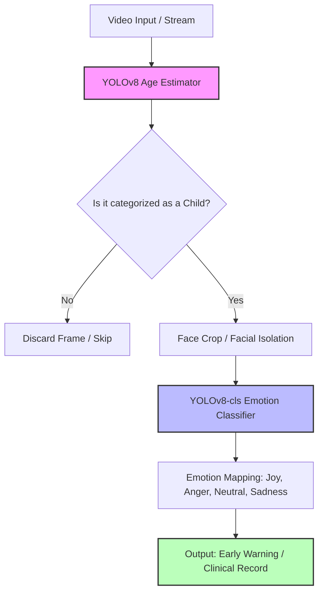
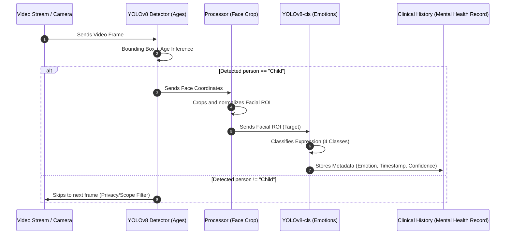
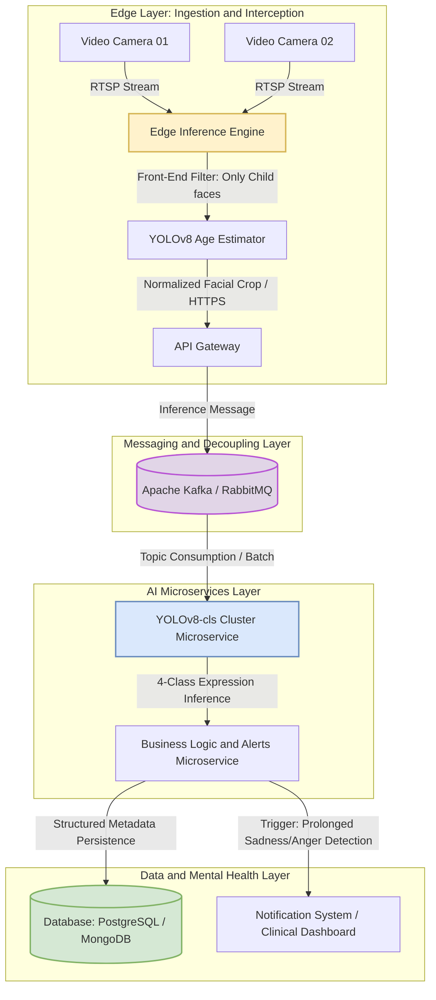

# AI-Driven Children's Emotion Recognition System for Mental Health Records

Artificial vision system optimized for highly vulnerable environments (foster homes, protection institutions, and educational centers) designed to detect children, estimate their age range, and classify their facial expressions into 4 high-value clinical emotions.

---

## 📺 Demonstration and Audiovisual Resources

To understand the behavior of the system in real time and analyze the technical breakdown of the project, the following resources are available:

* **[Project Explanatory Video](https://youtu.be/5WFmaxoqvQo):** Detailed presentation of the architecture, the training process, clinical justification, and engineering conclusions.
* **[Results Video](https://youtu.be/4_O08vyHsnU):** Real-time inference on video streams, visualization of demographic bounding boxes, and stability of emotional class predictions.

---

## 🎯 Problem and Clinical Justification

In institutional and pedagogical environments oriented towards the care of vulnerable children (such as government protection centers or foster homes), monitoring psychological well-being is a critical yet highly complex task. The evaluation of children's emotional states by human observers, while indispensable, faces persistent barriers: it is inherently subjective, varies according to the specialist's fatigue level, and lacks a standardized baseline metric that allows for the quantitative tracking of a minor's temporal evolution. 

This project was born to bridge that gap. Its fundamental purpose is to provide an automated, auditable, and objective system to act as a diagnostic support tool for psychologists, psychiatrists, and educators. By capturing micro-expressions and mood trends continuously, the platform automates the feeding of Mental Health Records, facilitating the early identification of warning signs (such as prolonged states of apathy, sadness, or contained anger) that often go unnoticed during intermittent observations.

**Engineering and Ethics Note:** This system **does not replace** clinical judgment or human professional intervention. Its role is purely bio-digital: it acts as a support sensor that translates unstructured data (video) into stable metrics to strengthen clinical and pedagogical decision-making.

### Target Variables (Clinical Classes)
To guarantee the system's viability within the mental health environment, the scope was restricted to four fundamental emotions of baseline and reactive states:
* **Joy:** An indicator of positive bonding, safe environments, and adaptability.
* **Anger:** An alert for frustration, defensive reactivity, or environmental stress pockets.
* **Neutral:** An indispensable baseline state to measure emotional reactivity and mood stability in the absence of external stimuli.
* **Sadness:** A critical monitoring factor for the early detection of depressive states, withdrawal, or adaptive helplessness.

---

## 🏗️ Inference Pipeline Architecture (Edge/Local)

The visual processing pipeline is structured in a sequential and modular manner under a logic of resource optimization and privacy protection. The entire video is not processed globally; instead, a hierarchical architecture is implemented to filter information by stages.

The logical interaction flow of the system is detailed below:



### Detailed Pipeline Analysis:

1. **Acquisition and Demographic Estimation (Front-End Filter):** The raw video stream enters the system, where a specialized YOLO model for age range estimation analyzes the scene. The model localizes the present faces and classifies them into categories (*Child, Adolescent, Adult, Elder*).
2. **Privacy Filter and Zero-Compute:** If the detected face does not belong to the *Child* category, the frame is immediately discarded from the memory buffer. This mitigates computational costs on embedded hardware (*edge computing*) and guarantees that the records of adults outside the clinical environment are neither processed nor stored.
3. **Facial Isolation (Region of Interest - ROI):** Upon confirming the presence of a minor, the system performs a dynamic crop based on the bounding box coordinates. This crop isolates the face, eliminating background noise (toys, walls, ambient light variations) that could confuse the expression classifier.
4. **Core Expression Inference:** The normalized facial crop is injected directly into the final classifier, which maps the features of the child's physiognomy towards a probability distribution over the 4 clinical interest classes for subsequent storage and integration with the medical history.

---

## 🔄 System Sequence Diagram

This diagram describes the temporal sequence of calls, processing, and data control directives from the moment the capture hardware registers a frame until the structured metadata is consolidated.



---

## 📊 Experimentation Matrix and Model Benchmarking

To break the accuracy ceiling and identify the architecture with the highest robustness against overfitting and lowest sensitivity to demographic bias, an experimentation scheme was designed to compare three independent approaches:

### Approach 1: Emotion_Model (ResNet18 Backbone)

This approach consisted of a coupled architecture where face detection by age fed a classical ResNet18 classifier trained from scratch on the dataset's subfolders.

* **Performance by Class:** Showed acceptable behavior for the *Joy* and *Neutral* classes.
* **Critical Failures:** Presented a severe adaptive bias towards the *Sadness* class. At the slightest ambiguity in facial features, the model tended to classify faces as sadness, which would invalidate its use in mental health due to generating an unacceptable volume of clinical false positives. Its decision boundary proved to be very weak due to the high physiognomic variability of children.
* **Global Metrics:**
* **Accuracy:** `0.554`
* **Macro F1-Score:** `0.531`


* **Status:** **Discarded.**

### Approach 2: YOLOv8-cls (Winning Model)

Native classifier based on the YOLOv8 architecture optimized for independent image classification tasks using the extracted regions of interest.

* **Performance by Class:** Demonstrated significantly superior discrimination capacity. Thanks to strict data augmentation policies in the training set and batch balancing, it achieved robust performance in highly reactive classes: *Joy, Sadness, and Anger*.
* **Identified Failures:** A technical difficulty persists when classifying the *Neutral* emotion, which tends to be intermittently confused with low-intensity micro-expressions of the other classes.
* **Global Metrics:**
* **Accuracy:** `0.717`
* **Macro F1-Score:** `0.706`


* **Status:** **Selected as the Base Production Model.**

### Approach 3: Pre-trained Public Model (Roboflow)

An *End-to-End* solution available in the state of the art, designed to infer age and emotion simultaneously in a single network pass.

* **Performance by Class:** Intermediate performance. Its main weakness lies in a **massive and systematic bias towards the *Joy* class**. The model tends to over-index smiling or relaxed features, erroneously classifying states of neutrality or mild sadness as happiness. Furthermore, being originally limited to only 3 classes, it does not align with the 4 categories required for a formal mental health clinical record.
* **Global Metrics:**
* **Accuracy:** `0.683`
* **Macro F1-Score:** `0.512`


* **Status:** **Discarded (Useful only as a baseline reference).**

---

## 🛠️ Engineering Decisions and Technical Bottlenecks

Based on the confusion matrices and learning curves analyzed in the notebook, the following engineering conclusions are established:

1. **Classification Architecture Selection:** **YOLOv8-cls** was chosen because it outperformed ResNet18 by **+16.3% in Accuracy** and **+17.5% in Macro F1-Score**. This demonstrates that YOLOv8's internal attention mechanisms and convolution blocks adapt better to extracting subtle facial features without saturating gradients.
2. **The Challenge of the "Neutral" Class:** The transitional behavior of the neutral emotion represents a challenge for all models. This occurs because the real expressions of children are highly dynamic and non-linear; a child's face at rest can share structural geometric characteristics with sadness or heavy concentration (classified as anger), generating overlaps in the model's latent space.
3. **Dataset Bottleneck (Data Bottleneck):** The final engineering diagnosis confirms that the current accuracy ceiling of the system is not limited by computational capacity or neural network parameters, but rather by the nature of the data available in the state of the art for children's faces. The current dataset presents visual noise, inconsistencies in the original labeling, and a limited volume compared to adult face datasets. To scale the system to strict medical reliability levels, future work must focus on fine re-labeling and controlled data expansion.

---

## 🚀 Future Architecture: Production Scalability and Maintainability (Next-Gen Cloud/Edge Architecture)

To guarantee that the system can operate continuously, process concurrent streams from multiple institutional cameras, and be easily maintained over time without performance degradation, a transition to a decoupled architecture based on event-driven microservices is proposed.

### Proposed Production Architecture Diagram

The following design distributes the computation between edge devices (*Edge*) for efficient data ingestion and cloud services (*Cloud*) for heavy inference, relational analysis, and secure storage.



### Key Components of the Production Ecosytem

#### 1. Efficient Edge Ingestion (Edge Layer)

* **Device Decoupling:** Cameras transmit via RTSP (*Real-Time Streaming Protocol*) to a centralized local node (such as a Jetson Nano or local PC).
* **Edge Core Execution:** The age estimator (`YOLOv8 Age Estimator`) runs directly on the *Edge*. By intercepting and discarding adult frames locally, unnecessary cloud upload traffic is avoided, optimizing bandwidth and natively protecting third-party privacy.

#### 2. High Availability Message Queue (Ingestion Layer)

* **Downtime Resilience:** The use of a Message Broker (such as Apache Kafka or RabbitMQ) acts as a buffer. If the emotion classification service suffers a heavy load or temporary disconnection, the processed face data is not lost; it is enqueued for asynchronous consumption.

#### 3. Scalable Classification Microservice (AI Inference Cluster)

* **Horizontal Scalability:** The winning model `YOLOv8-cls` is packaged in Docker containers and deployed in a cluster (e.g., AWS ECS or Kubernetes). If the system transitions from monitoring 2 cameras to 50 cameras in a hospital network, the cluster automatically provisions more instances of the classifier to maintain low latency.
* **Zero-Downtime Updates (CI/CD):** Allows for independent updates to the model weights (`best.pt`) or architecture retraining to mitigate the *Neutral* state bottleneck, without shutting down the rest of the software stack.

#### 4. Persistence and Mental Health Alerts (Storage & Notification Layer)

* **Auditable Structure:** Only anonymized metadata (encrypted minor ID, timestamp, confidence vector of the 4 emotions) is stored in a robust database, complying with international medical data standards (such as HIPAA/HL7).
* **Clinical Rules Engine:** The business microservice evaluates time windows. If it detects, for example, that a patient ID maintains a dominant vector of `Sadness` or `Anger` higher than 75% for more than 30 continuous minutes, an automated alert is triggered on the specialist's Dashboard for a prioritized human evaluation.

---

## 📂 Repository Structure

The file layout reflects the separation of responsibilities to guarantee pipeline reproducibility and data auditability:

```text
├── Dataset
│   ├── data
│   │   ├── test       <- Balanced final validation sets (4 clinical classes)
│   │   ├── train      <- Processed training data for YOLOv8-cls
│   │   └── val        <- Overfitting control and hyperparameter tuning
│   └── labeled        <- Original raw data with extended labels (e.g., Surprise)
├── final_run          <- Deployment, execution, and real-time video inference scripts
├── model              <- System artifacts, weights (.pt), and training logs
└── Children-s-Emotion-Recognition.ipynb  <- Main notebook for experimentation and development