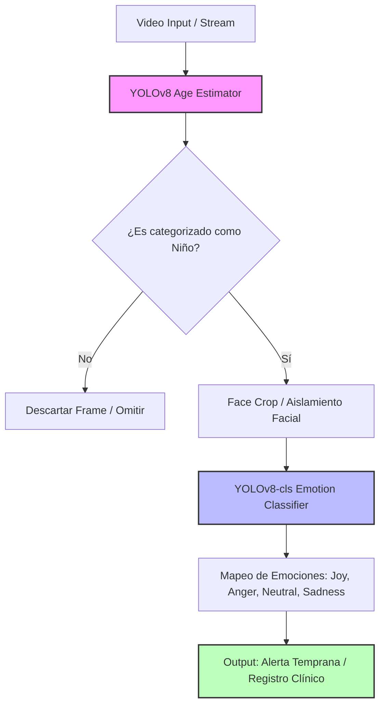
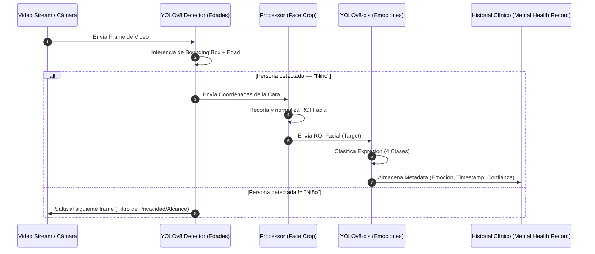
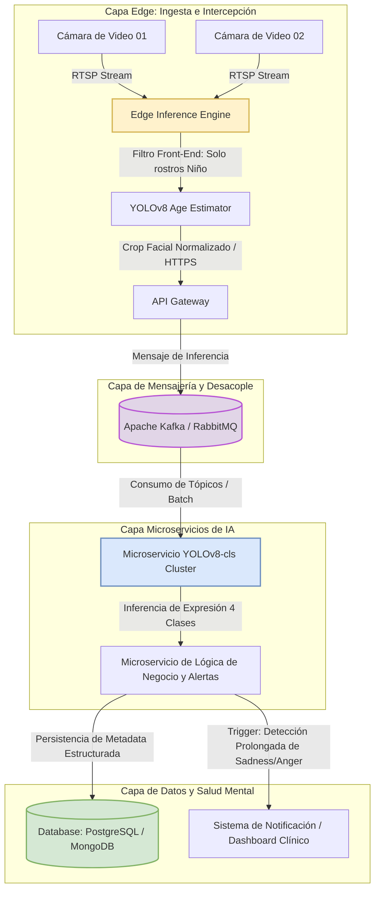

# AI-Driven Children's Emotion Recognition System for Mental Health Records

Sistema de visión artificial optimizado para entornos de alta vulnerabilidad (hogares de paso, instituciones de protección y centros educativos) diseñado para detectar niños, estimar su rango de edad y clasificar sus expresiones faciales en 4 emociones de alto valor clínico.

---

## Demostración y Recursos Audiovisuales

Para comprender el comportamiento del sistema en tiempo real y analizar la sustentación técnica del proyecto, se encuentran disponibles los siguientes recursos:

* **[Video Explicativo del Proyecto](https://youtu.be/5WFmaxoqvQo):** Sustentación detallada de la arquitectura, el proceso de entrenamiento, la justificación clínica y las conclusiones de ingeniería.
* **[Video de Resultados](https://youtu.be/4_O08vyHsnU):** Inferencia en tiempo real sobre flujos de video, visualización de *bounding boxes* demográficos y estabilidad de las predicciones de las clases emocionales.

---

## Problema y Justificación Clínica

En entornos institucionales y pedagógicos orientados a la atención de la infancia vulnerable (como centros de protección del Estado u hogares de paso), el seguimiento del bienestar psicológico es una tarea crítica pero altamente compleja. La evaluación del estado emocional de los niños por parte de observadores humanos, aunque indispensable, se enfrenta a barreras persistentes: es intrínsecamente subjetiva, varía según el nivel de fatiga del especialista y carece de una métrica base estandarizada que permita registrar la evolución temporal del menor de manera cuantitativa. 

Este proyecto nace para cerrar esa brecha. Su propósito fundamental es proveer un sistema automatizado, auditable y objetivo que actúe como una herramienta de apoyo al diagnóstico para psicólogos, psiquiatras y educadores. Al capturar microexpresiones y tendencias anímicas de forma continua, la plataforma automatiza la alimentación de los Registros de Salud Mental, facilitando la identificación de alertas tempranas (como estados prolongados de apatía, tristeza o ira contenida) que a menudo pasan desapercibidos en observaciones intermitentes. 

**Nota de Ética e Ingeniería:** Este sistema **no reemplaza** el criterio clínico ni la intervención del profesional humano. Su rol es puramente bio-digital: actúa como un sensor de soporte que traduce datos no estructurados (video) en métricas estables para robustecer la toma de decisiones clínicas y pedagógicas.

### Variables Objetivo (Clases Clínicas)
Para garantizar la viabilidad del sistema en el entorno de la salud mental, el alcance se acotó a cuatro emociones fundamentales del estado base y reactivo:
* **Joy (Alegría):** Indicador de vinculación positiva, entornos seguros y adaptabilidad.
* **Anger (Ira):** Alerta de frustración, reactividad defensiva o focos de estrés ambiental.
* **Neutral:** Estado base indispensable para medir la reactividad emocional y la estabilidad anímica en ausencia de estímulos externos.
* **Sadness (Tristeza):** Factor crítico de monitoreo para la detección temprana de cuadros depresivos, retraimiento o desamparo adaptativo.

---

## Arquitectura del Pipeline de Inferencia (Edge/Local)

El pipeline de procesamiento visual está estructurado de manera secuencial y modular bajo una lógica de optimización de recursos y protección de la privacidad. No se procesa todo el video de forma global; en su lugar, se implementa una arquitectura jerárquica que filtra la información por etapas.

A continuación se detalla el flujo lógico de interacción del sistema:



### Análisis Detallado del Pipeline:

1. **Adquisición y Estimación Demográfica (Filtro Front-End):** El flujo de video crudo ingresa al sistema, donde un modelo YOLO especializado en estimación de rangos de edad analiza la escena. El modelo localiza los rostros presentes y los clasifica en categorías (*Niño, Adolescente, Adulto, Adulto Mayor*).
2. **Filtro de Privacidad y Cómputo Cero:** Si el rostro detectado no pertenece a la categoría *Niño (Child)*, el frame se descarta inmediatamente del buffer de memoria. Esto mitiga costos computacionales en hardware empotrado (*edge computing*) y garantiza que los registros de adultos ajenos al entorno clínico no sean procesados ni almacenados.
3. **Aislamiento Facial (Region of Interest - ROI):** Al confirmarse la presencia de un menor, el sistema realiza un recorte dinámico (*crop*) basado en las coordenadas de la caja delimitadora (*bounding box*). Este recorte aísla la cara, eliminando ruidos de fondo (juguetes, paredes, variaciones de luz ambiental) que podrían confundir al clasificador de expresiones.
4. **Inferencia Core de Expresiones:** El recorte facial normalizado se inyecta directamente al clasificador final, el cual mapea los rasgos de la fisonomía infantil hacia una distribución de probabilidad sobre las 4 clases de interés clínico para su posterior almacenamiento e integración con el historial médico.

---

## Diagrama de Secuencia del Sistema

Este diagrama describe la secuencia temporal de las llamadas, el procesamiento y las directivas de control de datos desde que el hardware de captura registra un frame hasta que la metadata estructurada es consolidada.



---

## Matriz de Experimentación y Benchmarking de Modelos

Para romper el techo de precisión e identificar la arquitectura con mayor robustez frente al sobreajuste y menor sensibilidad al sesgo demográfico, se diseñó un esquema de experimentación comparando tres enfoques independientes:

### Enfoque 1: Emotion_Model (Backbone ResNet18)

Este enfoque consistió en una arquitectura acoplada donde la detección de rostros por edad alimentaba a un clasificador clásico ResNet18 entrenado desde cero en las subcarpetas del dataset.

* **Rendimiento por clase:** Mostró un comportamiento aceptable para las clases *Joy* y *Neutral*.
* **Fallas Críticas:** Presentó un severo sesgo adaptativo hacia la clase *Sadness*. Ante la más mínima ambigüedad en las facciones, el modelo tendía a clasificar los rostros como tristeza, lo cual invalidaría su uso en salud mental al generar un volumen inaceptable de falsos positivos clínicos. Su frontera de decisión demostró ser muy débil debido a la alta variabilidad fisonómica de los niños.
* **Métricas Globales:** * **Accuracy:** `0.554`
* **F1-Score Macro:** `0.531`


* **Estado:** **Descartado.**

### Enfoque 2: YOLOv8-cls (Modelo Ganador)

Clasificador nativo basado en la arquitectura YOLOv8 optimizado para tareas de clasificación de imágenes independientes a partir de las regiones de interés extraídas.

* **Rendimiento por clase:** Demostró una capacidad de discriminación significativamente superior. Gracias a políticas estrictas de aumentación de datos en el set de entrenamiento y balanceo de lotes, logró un rendimiento robusto en las clases altamente reactivas: *Joy, Sadness y Anger*.
* **Fallas Identificadas:** Persiste una dificultad técnica al clasificar la emoción *Neutral*, la cual suele confundirse de manera intermitente con microexpresiones de baja intensidad de las demás clases.
* **Métricas Globales:**
* **Accuracy:** `0.717`
* **F1-Score Macro:** `0.706`


* **Estado:** **Seleccionado como el Modelo Base de Producción.**

### Enfoque 3: Modelo Público Preentrenado (Roboflow)

Una solución *End-to-End* disponible en el estado del arte, diseñada para inferir edad y emoción de manera simultánea en una sola pasada de red.

* **Rendimiento por clase:** Rendimiento intermedio. Su debilidad principal radica en un **sesgo masivo y sistemático hacia la clase *Joy***. El modelo tiende a sobreponderar rasgos sonrientes o relajados, clasificando erróneamente estados de neutralidad o tristeza leve como felicidad. Además, al estar limitado originalmente a solo 3 clases, no se alinea con las 4 categorías necesarias para un registro clínico formal de salud mental.
* **Métricas Globales:**
* **Accuracy:** `0.683`
* **F1-Score Macro:** `0.512`


* **Estado:** **Descartado (Útil solo como línea base de referencia).**

---

## Decisiones de Ingeniería y Cuellos de Botella Técnicos

A partir de las matrices de confusión y las curvas de aprendizaje analizadas en el notebook, se establecen las siguientes conclusiones de ingeniería:

1. **Selección de la Arquitectura de Clasificación:** Se optó por **YOLOv8-cls** debido a que superó a ResNet18 por un **+16.3% en Accuracy** y un **+17.5% en F1-Macro**. Esto demuestra que los mecanismos de atención interna y los bloques de convolución de YOLOv8 se adaptan mejor a la extracción de características faciales sutiles sin saturar los gradientes.
2. **El Desafío de la Clase "Neutral":** El comportamiento transicional de la emoción neutral representa un desafío para todos los modelos. Esto ocurre porque las expresiones reales de los niños son altamente dinámicas y no lineales; un rostro infantil en reposo puede compartir características geométricas estructurales con la tristeza o la concentración pesada (clasificada como ira), lo que genera solapamientos en el espacio latente del modelo.
3. **Cuello de Botella en el Dataset (Data Bottleneck):** El diagnóstico de ingeniería final confirma que el techo de precisión actual del sistema no está limitado por la capacidad computacional o los parámetros de la red neuronal, sino por la naturaleza de los datos disponibles en el estado del arte para rostros infantiles. El dataset actual presenta ruido visual, inconsistencias en el etiquetado original y un volumen limitado en comparación con datasets de rostros adultos. Para escalar el sistema a niveles de confiabilidad médica severa, el trabajo futuro debe centrarse en el re-etiquetado fino y la expansión de datos controlada.

Aquí tienes la propuesta para una sección de arquitectura futura, escalable y mantenible, diseñada en Markdown limpio y lista para integrar en tu `README.md`.

Esta arquitectura migra el flujo desde un script monolítico local hacia un ecosistema basado en microservicios, desacoplando la ingesta de video, el cómputo pesado de IA e integrando de manera segura el almacenamiento en registros médicos clínicos.

---

## Arquitectura Futura: Escalabilidad en Producción y Mantenibilidad (Next-Gen Cloud/Edge Architecture)

Para garantizar que el sistema pueda operar de forma continua, procesar flujos concurrentes de múltiples cámaras institucionales y mantenerse fácilmente a lo largo del tiempo sin degradación de rendimiento, se propone una transición hacia una arquitectura desacoplada basada en microservicios orientados a eventos.

### Diagrama de la Arquitectura de Producción Propuesta

El siguiente diseño distribuye el cómputo entre dispositivos perimetrales (*Edge*) para la ingesta eficiente de datos y servicios en la nube (*Cloud*) para la inferencia pesada, el análisis relacional y el almacenamiento seguro.



---

### Componentes Clave del Ecosistema de Producción

#### 1. Ingesta Perimetral Eficiente (Edge Layer)

* **Desacoplamiento de Dispositivos:** Las cámaras transmiten mediante protocolo RTSP (*Real-Time Streaming Protocol*) hacia un nodo centralizado local (como una Jetson Nano o PC local).
* **Edge Core Execution:** El estimador de edad (`YOLOv8 Age Estimator`) corre directamente en el *Edge*. Al interceptar y descartar localmente los frames de adultos, se evita subir tráfico innecesario a la nube, optimizando el ancho de banda y protegiendo de raíz la privacidad de terceros.

#### 2. Cola de Mensajería de Alta Disponibilidad (Ingestion Layer)

* **Resiliencia ante Caídas:** El uso de un Broker de Mensajería (como Apache Kafka o RabbitMQ) actúa como un amortiguador (*buffer*). Si el servicio de clasificación de emociones sufre una alta carga o desconexión temporal, los datos de los rostros procesados no se pierden; se encolan para su consumo asíncrono.

#### 3. Microservicio Escalable de Clasificación (AI Inference Cluster)

* **Escalabilidad Horizontal:** El modelo ganador `YOLOv8-cls` se empaqueta en contenedores Docker y se despliega en un clúster (ej. AWS ECS o Kubernetes). Si el sistema pasa de monitorear 2 cámaras a 50 cámaras en una red hospitalaria, el clúster añade automáticamente más instancias del clasificador para mantener la latencia baja.
* **Actualizaciones sin Interrupción (CI/CD):** Permite actualizar el peso del modelo (`best.pt`) o reentrenar la arquitectura para mitigar el cuello de botella del estado *Neutral* de forma independiente, sin apagar el resto del software.

#### 4. Persistencia y Alertas de Salud Mental (Storage & Notification Layer)

* **Estructura Auditable:** Guarda únicamente metadatos anonimizados (ID del menor encriptado, timestamp, vector de confianza de las 4 emociones) en una base de datos robusta, cumpliendo con estándares internacionales de datos médicos (como HIPAA/HL7).
* **Motor de Reglas Clínicas:** El microservicio de negocio evalúa ventanas de tiempo. Si detecta, por ejemplo, que un ID de paciente mantiene un vector dominante de `Sadness` o `Anger` superior al 75% durante más de 30 minutos continuos, se dispara una alerta automatizada en el Dashboard del especialista para una evaluación humana prioritaria.

---

## Estructura del Repositorio

La disposición de los archivos refleja la separación de responsabilidades para garantizar la reproducibilidad del pipeline y la auditoría de los datos:

```text
├── Dataset
│   ├── data
│   │   ├── test       <- Sets balanceados de validación final (4 clases clínicas)
│   │   ├── train      <- Datos procesados de entrenamiento para YOLOv8-cls
│   │   └── val        <- Control de Overfitting y tuning de hiperparámetros
│   └── labeled        <- Datos crudos originales con etiquetas extendidas (ej. Surprise)
├── final_run          <- Scripts de despliegue, ejecución e inferencia sobre video
├── model              <- Artefactos del sistema, pesos (.pt) y registros de entrenamiento
└── Children-s-Emotion-Recognition.ipynb  <- Notebook principal de experimentación y desarrollo

```